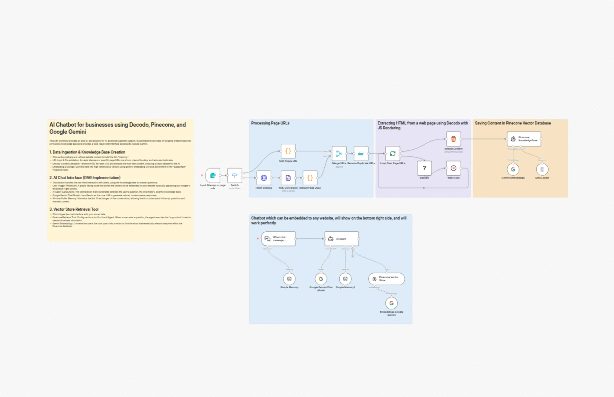

# Build a website-powered customer support chatbot with Decodo, Pinecone and Gemini

Advanced n8n automation for Build a website-powered customer support chatbot with Decodo, Pinecone and Gemini.

## Overview
- Category: Support Chatbot, AI RAG
- Complexity: advanced
- Source: n8n workflow template export

## What This Automation Does
Build a custom AI support chatbot in minutesauto-scrape your site, RAG with Gemini + Pinecone, embed anywhere, accurate answers from your data.

## Included Files
- `workflow.json`

## Setup
1. Import `workflow.json` into n8n.
2. Configure required credentials for the services used in the workflow nodes.
3. Update any environment variables or static values inside nodes (API keys, URLs, IDs).
4. Run a test execution and then activate the workflow.

## Tech Stack

- `@decodo/n8n-nodes-decodo.decodo`
- `@n8n/n8n-nodes-langchain.agent`
- `@n8n/n8n-nodes-langchain.chatTrigger`
- `@n8n/n8n-nodes-langchain.documentDefaultDataLoader`
- `@n8n/n8n-nodes-langchain.embeddingsGoogleGemini`
- `@n8n/n8n-nodes-langchain.lmChatGoogleGemini`
- `@n8n/n8n-nodes-langchain.memoryBufferWindow`
- `@n8n/n8n-nodes-langchain.vectorStorePinecone`
- `n8n-nodes-base.code`
- `n8n-nodes-base.formTrigger`
- `n8n-nodes-base.html`
- `n8n-nodes-base.httpRequest`
- `n8n-nodes-base.merge`
- `n8n-nodes-base.removeDuplicates`
- `n8n-nodes-base.splitInBatches`
- `n8n-nodes-base.stickyNote`
- `n8n-nodes-base.switch`
- `n8n-nodes-base.wait`
- `n8n-nodes-base.xml`

## Author

Murtaza Baig

## Screenshots

## License
MIT License. See `LICENSE`.